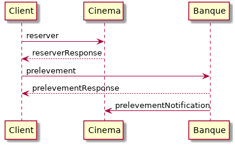
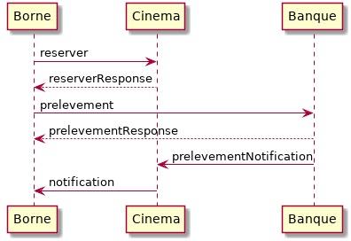

# TP RabbitMQ

[RabbitMQ](https://www.rabbitmq.com/) est un *message broker*, c'est-à-dire un système qui s'occupe de la transmission de messages, typiquement de manière fiable avec une sauvegarde des messages non traités.

Ce TP a pour objectif d'apprendre à utiliser RabbitMQ. RabbitMQ étant plutôt intéressant dans un cadre de communications asynchrones, on l'utilisera ici pour gérer la partie paiement de la réservation.

## Processus de réservation

On veut intégrer une partie paiement au processus de réservation.
Le diagramme ci-dessous indique les communications qui ont lieu lors d'une réservation.



On considèrera que le compte de du cinema est le compte 234567890.

Remarque: dans ce TP, cela devrait être un débit de carte bancaire et non un prélèvement qui serait utilisé. On conservera cependant la notion de prélèvement afin de minimiser les changements à apporter.

## Mise en oeuvre de RabbitMQ et premier client

### Serveur RabbitMQ

Le moyen le plus simple de déployer RabbitMQ est de le lancer dans un [conteneur](https://hub.docker.com/_/rabbitmq/) docker:

``` shell
docker run --rm -d --hostname rabbitmq --name rabbitmq -p 15672:15672 -p 5672:5672 rabbitmq:3-management
```

Une interface Web est disponible sur le port 15672, typiquement [http://localhost:5672](http://localhost:5672).
Le login et le mot de passe par défaut est `guest`.

Une instance partagée sera également deployée le temps du TP.
Si vous utilisez cette instance, il faudra, afin de ne pas interférer avec les autres étudiants, changer les nom des queues en y intégrant un identifiant qui vous est propre (par exemple votre login étudiant).
De plus, à cause des limitations sur les numéros de port, il faudra utiliser le port 5432 au lieu du port 5672, et le port 8080 au lieu du port 15672.

### Client

Modifier le service de la banque pour prendre une référence optionnelle lors d'un prélèvement.

Lire le [tutoriel de démarrage en Java](https://www.rabbitmq.com/tutorials/tutorial-one-java.html).
Adapter le code pour que la banque envoie sur la queue ` cinema` un message JSON de la forme suivante lorsqu'un prélèvement a lieu au bénéfice du compte du cinéma lorsqu'une référence a été indiquée.

``` json
{
	"compte": 123456789,
	"montant": 20,
	"ref": "xyz"
}
```

Remarques/liens:

- Artifact maven pour le client RabbitMQ: [amqp-client](https://search.maven.org/artifact/com.rabbitmq/amqp-client/5.5.1/jar).
- Il est possible d'utiliser l'interface Web de RabbitMQ pour vérifier que des messages sont biens envoyés dans une queue.

## Reception de message: traitement du paiement

Modifier l'application cinema (tp 3/7) afin de surveiller la queue `cinema` et changer la valeur du champ `paye` pour la réservation dont l'identifiant correspond à la référence (`ref`) transmise dans le message.

Pour cette partie, il est possible d'utiliser au choix directement le client AMQP comme précédement, ou bien utiliser l'intégration dans spring ([Spring AMQP](http://spring.io/projects/spring-amqp)).

## Queues dynamiques: bornes de tickets

Créer une nouvelle application (par exemple avec Spring Boot) qui va représenter une borne de tickets.
Dans le cadre de ce TP on munira cette application d'une interface simple pour remplacer l'interface graphique de la borne: par exemple un contrôleur REST ou une interface texte sous forme d'un petit shell.

Lorsqu'une réservation est effectuée par l'intermédiaire de la borne, c'est cette dernière qui va déclencher les appels aux services de réservation et de banque.

Modifier le WSDL et le service de réservation afin de pouvoir préciser au choix, les nom, prénom et email ou l'identifiant d'une borne.

Faire que la borne écoute une queue RabbitMQ qui dépend de son identifiant.
Faire que le cinéma envoie une notification concernant la validation (paiement) d'une réservation à la borne qui en est originaire (quand c'est une borne qui a fait la réservation).
Lorsqu'elle reçoit une telle notification, la borne affiche un message de log approprié (pour simuler l'impression des tickets).

Le fonctionnement du système de bornes est résumé dans le diagramme suivant:



Tester le bon fonctionnement du système, d'abord avec une, puis avec deux bornes, afin de vérifier que les messages ne sont pas mélangés.
